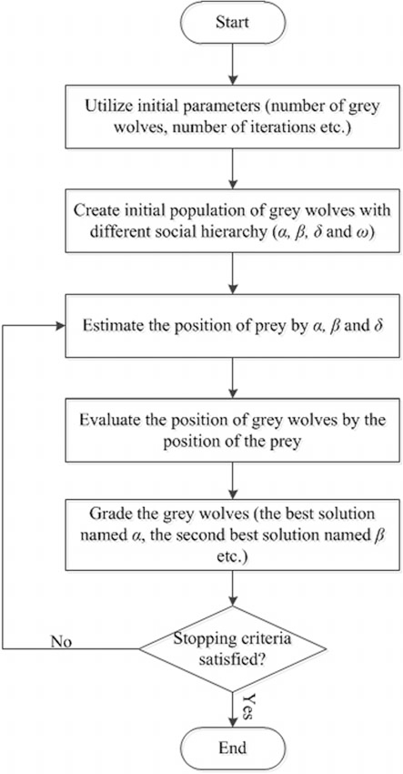

# Grey Wolf Optimization
## Foundations

Grey Wolf Optimization (GWO) is a new swarm intelligence algorithms for finding the best global solution. The GWO algorithm models the behaviour of grey wolves by social hierarchy. The wolf with the best position ist the alpha-wolf, the semi-best positioned wolf is the beta-wolf and the third-best positioned wolf is the delta-wolf. All the other wolves are gamma-wolves. The Swarm is made of initial population composed of particles to search in the solution space. In GWO, every wolf has its own position composed of D dimensions, a fitness value, which represents the accommodation of the wolf to the fitness function.

* Hunting the prey

Hunting the prey in GWO means finding the best global solution of a function. Therefore the wolves move  around in the area of the function.
Because wolves are leaded by the dominant wolf or a dominant pair of wolves, in GWO all not dominant wolves follow the dominant ones. Therefore the gamma-wolves (not dominant) move to where the three dominant wolfes (alpha, beta and delta) are. Every dominant wolf has the same relevance in GWO so the gamma-wolves move in the direction of all of the dominant wolves. 

## Algorithm

* N wolves are created.
* The positions are initialized.
* According to the fitness function of each wolf is evaluated and the best three wolves are kept in memory.
* The prey gets hunted.
* The position of the wolves get evaluated and rated.
* Check the termination condition. 